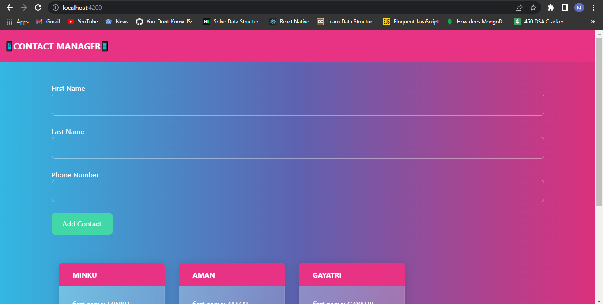
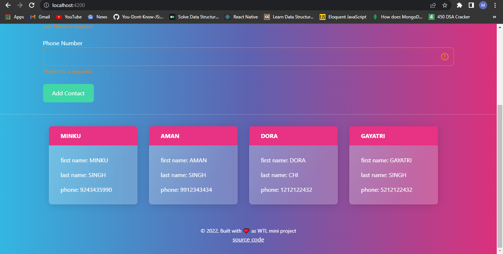
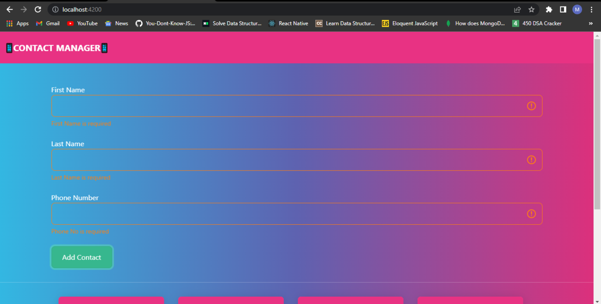
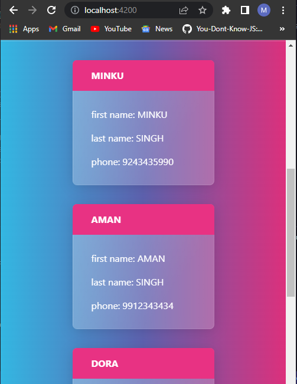
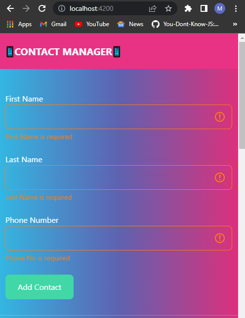
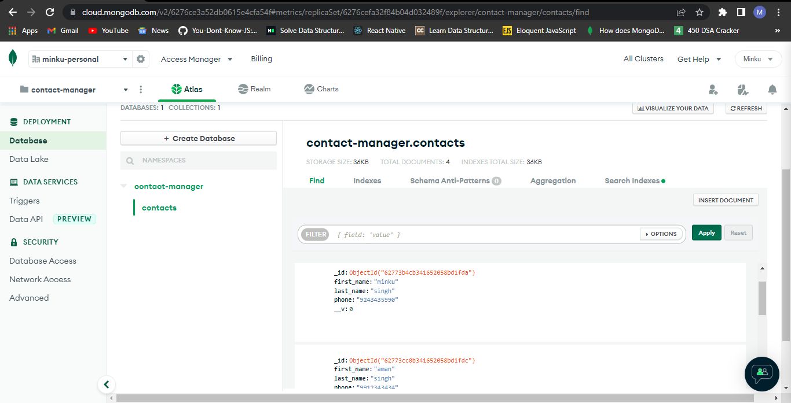

# Contact-Manager-Using-MEAN-Stack
Contact list manager web app using  MongoDB, Express.js, AngularJS, and Node.js (MEAN stack)

# UI of the web app
## big screen

## mobile screen

## data getting saved to backend

